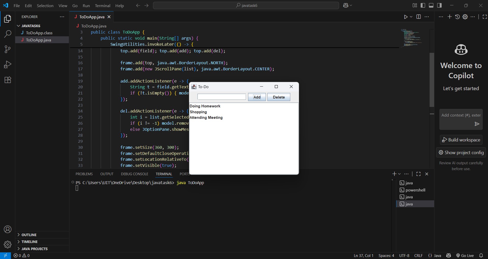

# java-swing-todo-app

## Description
A simple desktop To-Do List application built using Java Swing.  
You can add tasks, delete selected tasks, and view your list with a scrollable interface.  
This project helps beginners learn basic Java GUI development using JFrame, JButton, JTextField, and event handling.

## Screenshot


## How to Run
1. Clone this repository.  
2. Open in IntelliJ IDEA or Eclipse.  
3. Run the `ToDoApp.java` file.  
4. Alternatively, compile and run via terminal:
   ```bash
   javac ToDoApp.java
   java ToDoApp
   ```
## Author
Harisivanarayana

---

Thank you for checking out my Java Swing To-Do App!  
Feel free to reach out if you have any questions or feedback. 😊
